## Java设计模式

### 目录

* [创建模式(Creational Pattern)--7个](#cp)
* [结构模式(Structural Pattern)--8个](#sp)
* [行为模式(Behavioral Pattern)--8个](#bp)

<h3 id="cp">创建模式(Creational Pattern)</h3>

- 单例模式(Singlton)

	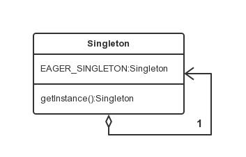
	
- 多例模式(Multiton)

	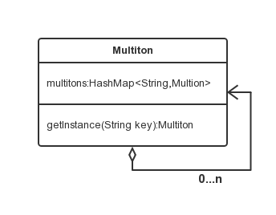
	
- 建造模式(Builder)

	

	* 对建造过程进行指挥的责任(Director)和具体建造者零件的责任(Builder)分割开来，实现责任划分和封装的目的。
	
	* 需要生成的产品对象有复杂的内部结构，有时在某个性质没有赋值之前，另一个性质则无法赋值。

	* 需要生成的产品对象的属性相互依赖,建造模式可以强制实行一种分步骤进行的建造过程。

	* 在对象创建过程中会使用系统中的其它一些对象，这些对象在产品对象的创建过程中不易得到。

- 原始模型模式(Prototype)

	

	* 当一个系统的产品类是动态加载的，并且产品类具有一定的等级结构。

<h3 id="sp">结构模式(Structural Pattern)</h3>

- 桥梁模式(Bridge)

	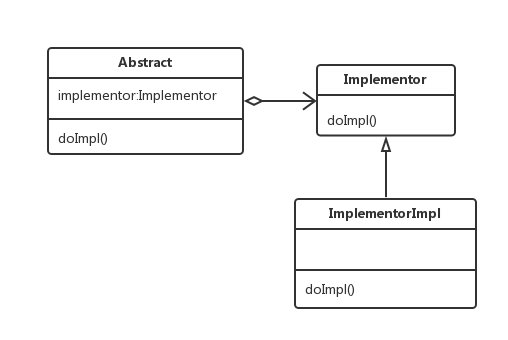

	* 将抽象化和实现化脱耦，使得二者可以独立地变化。这里的脱耦时将强关联转换为弱关联。

- 门面模式(Facade)

	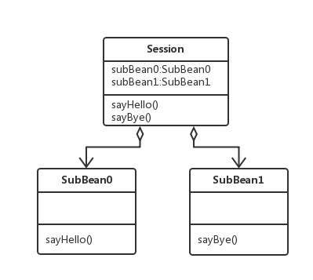

	* 门面将客户端与子系统的内部分割开。

	* 门面模式要求一个子系统的外部与其内部的通信必须通过一个统一的门面对象进行。门面模式提供一个统一的高层次的接口，使得子系统更易于使用。

	* 子系统往往会因为需求而变得越来越复杂，使用门面模式可以使得子系统更具有复用性。

- 代理模式(Proxy)

	

	* 代码层次上的代理模式和装饰模式有很大的相似性。

	* jdk实现：InvocationHandler与Proxy

- 合成模式(Composite)(安全式的:将对聚集的处理放在组件层)

	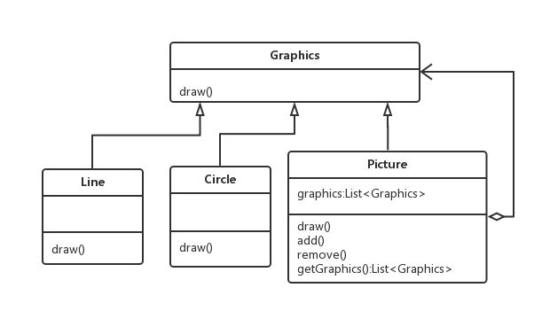

	* 把部分和整体的关系用树结构表示出来。合成模式使得客户端把一个个单独的成分对象和由它们复合而成的合成对象同等对待。
	
	* 需要描述对象的部分和整体的等级结构。

	* 需要客户端忽略掉个体构件和组合构件的区别。

- 适配器模式(Adapter)
	
	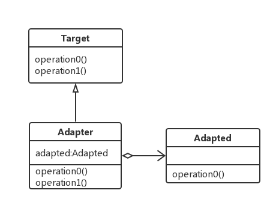
	
	* 一个适配器可以把多种不同的源适配到同一个目标。

- 装饰模式(Decorator)

	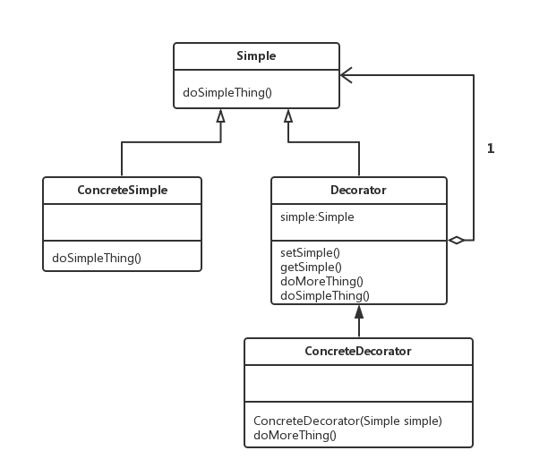
	
	* 需要扩展一个类的功能的时候，或给一个类增加附加责任。

	* 需要动态地给一个对象增加功能，这些功能可以动态地撤销。

	* 需要增加由一些基本功能的排序组合而产生的非常大量的功能，从而使继承关系变得不现实。

- 享元模式(Flyweight)

	
	* 一个系统有大量的对象。

	* 这些对象耗费大量的内存。

	* 这些对象的状态中的大部分都可以外部化。

	* 这些对象可以按照内蕴状态分成很多的组，当把外蕴状态从对象中剔除时，每一个组都可以仅用一个对象代替。

	* 软件系统不依赖于这些对象的身份，换言之，这些对象是不可分辨的。

<h3 id="bp">行为模式(Behavioral Pattern)</h3>

- 观察者模式(Observer)

	
	
	* 一个对象状态发生改变时，其他对象的状态也发生改变。

- 命令模式(Command)

	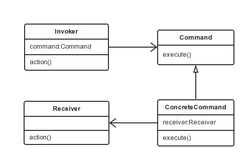
	
	* 把请求一个操作的对象与知道怎么执行一个操作的对象分割开。

	* 使用命令模式作为Callback在面向对象系统的替代。这里Callback讲的便是先将一个函数登记上，然后在以后调用此函数。
- 责任链模式(Chain of Responsibility)

	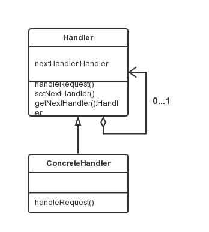
	
	* 有多于一个的处理者对象会处理一个请求，而且事先并不知道到底由哪个处理者对象处理一个请求。这个处理者对象是动态确定的。

	* 系统想发出一个请求给多个处理者对象中的某一个，但是不明显指定是哪一个处理者对象会处理此请求。

	* 纯的责任链模式要求只能由一个处理者对象负责处理请求的责任。但一般很少见。

- 不变模式(Immutable)

	* 一个类的内部状态创建后，在整个生命期间都不会发生变化时，这样的类称为不变类。

	* 因为没有一个线程可以修改不变对象的内部状态，一个不变对象自动就是线程安全的。

- 策略模式(Strategy)

	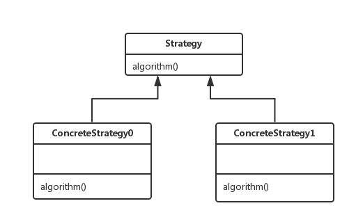

	* 如果在一个系统中有许多类，它们之间的区别仅在于它们的行为，那么使用策略模式可以动态的让一个对象在许多行为中选择一种。

- 迭代子模式(Iterator)

	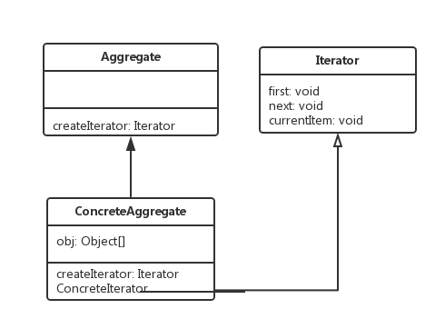

	* 抽象出迭代逻辑和聚集。

	* 白箱聚集与外稟迭代子: 迭代子在聚集外部，聚集提供统一接口。

	* 黑箱聚集与外稟迭代子: 迭代子是内部类。聚集只对内部提供接口。

- 备忘录模式(Memento)

	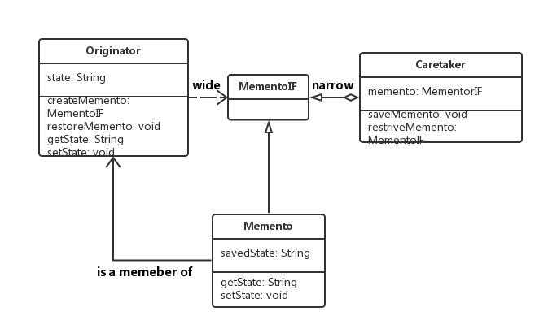

	* 备忘录对象是一个用来存储另外一个对象内部状态的快照的对象。

	* 备忘录模式的用意是在不破坏封装的条件下，将一个对象的状态捕抓住，并外部化，存储起来，从而可以在合适的时候还原到存储起来的状态。

	* 适用于发起人对象的内部状态必须保存在该对象以外的对象中。

- 状态模式(State)

	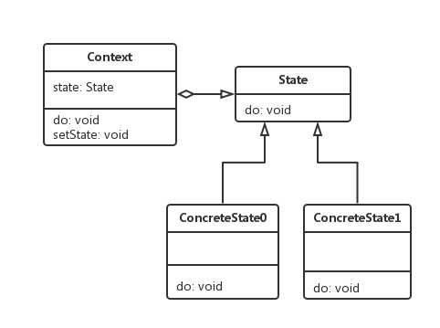

	* 当一个对象的行为依赖于它所处的状态，对象的行为必须随着其状态的改变而改变。

	* 需要省略条件转移语句，避免耦合。
